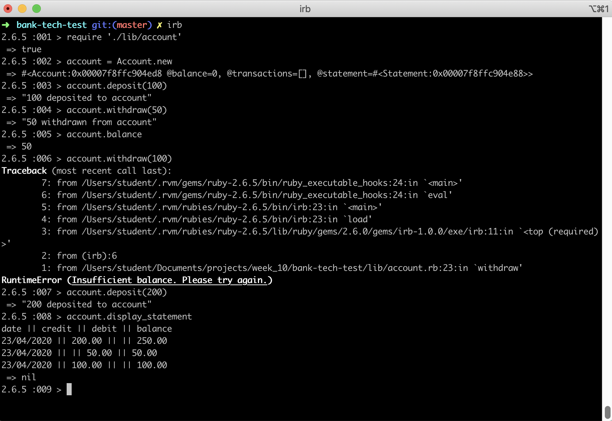
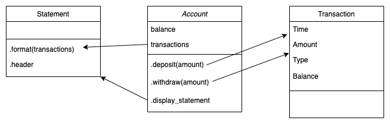

Bank Tech Test
===================

This project is a practice tech test. The requirements were as follows:

#### Requirements

* You should be able to interact with your code via a REPL like IRB or the JavaScript console.  (You don't need to implement a command line interface that takes input from STDIN.)
* Deposits, withdrawal.
* Account statement (date, amount, balance) printing.
* Data can be kept in memory (it doesn't need to be stored to a database or anything).

#### Acceptance criteria

**Given** a client makes a deposit of 1000 on 10-01-2012
**And** a deposit of 2000 on 13-01-2012
**And** a withdrawal of 500 on 14-01-2012
**When** she prints her bank statement
**Then** she would see

```
date || credit || debit || balance
14/01/2012 || || 500.00 || 2500.00
13/01/2012 || 2000.00 || || 3000.00
10/01/2012 || 1000.00 || || 1000.00
```
Getting Started
===================

#### Setup

To use this project:

- `git clone` this repo to your local machine
- `cd` into the folder
- Run the command `gem install bundle` (if you don't already have bundle installed)

#### Dependencies

To install dependencies:

```
$ bundle install
```

#### Running the App

To start up the app:

```
$ irb
> require './lib/account'
```

#### Interacting with the App

Once in irb, use the following commands to create an account, deposit and withdraw money, check your balance, and print your statement of account.

```
> account = Account.new
> account.deposit(amount)
> account.withdraw(amount)
> account.balance
> account.display_statement
```

Example:



Running Tests
===================

This project is setup with:
- RSpec (for testing)
- SimpleCov (for test coverage)
- Rubocop (for linting)

To run the tests:
```
$ bundle exec rspec
$ bundle exec rubocop
```

Criteria for Building the Project
===================

#### Approach

 In addition to the requirements above, I made the assumption that the user would also like to check their balance and ensure that they do not go into overdraft by receiving a helpful message if they try to withdraw more money than what is available in the account.

Starting with the user stories below, I implemented an Account class with methods to deposit and withdraw funds. These methods updated the balance and added transaction details to a hash, stored in a transactions array. As per the domain model I had sketched out prior, I later extracted those transaction details (time, amount and type) to an instance of a Transaction class. At the time I didn't feel that the current balance should be an attribute of a Transaction instance.

The next step was to print the statement of account which I first implemented in the Account class, later to be extracted to a Statement class that would deal only with formatting and returning the statement. One refactored into the Statement class, I discovered that my formatting method was doing 2 things; firstly it was formatting the transaction but it was also calculating the cumulative balance on each iteration. To overcome this, I decided it was best that the current balance be moved to an attribute of the transaction class.

The Statement class now clearly deals with formatting dates, numbers and line transaction details. The details held in each instance of a Transaction remain in their raw form, so that going forward should any further features be implemented, one can still access the amounts as numbers rather than strings, and the full timestamp as opposed to just a date.

The unit tests are fully mocked to ensure the classes work in isolation, all tests pass and the test coverage is 100%.

#### Domain Model



#### User Stories

```
As a user
So that I can store my money in a secure place
I would like to deposit money into my account

As a user
So that I can take out money for spending
I would like to withdraw money from my account

As a user
So that I know how much money is in my account
I would like to see the balance on my account

As a user
So that I do not go into overdraft
I would like to see a helpful error message if I try to take out more money than what is in my account

As a user
So that I can see a list of all my account transactions
I would like to print my statement of account
```

